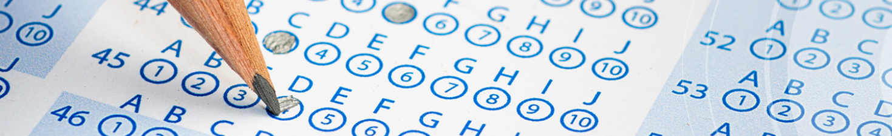
# School District Analysis

## Project Overview
The focus of this project is analyzing performance trends and patterns within the school district in order to assist the school board in making decisions regarding school budget and priorities. This analysis also includes the changes of math and reading scores for Thomas High School and compares these data changes with previous analysis. This analysis provides updated:

- The district summary
- The school summary
- The top 5 and bottom 5 performing schools, based on the overall passing rate
- The average math score for each grade level from each school
- The average reading score for each grade level from each school
- The scores by school spending per student, by school size, and by school type

## District Results
### District Summary
- There was a slight decrease in the percentage of students passing Math, passing reading, and overall passing comparing the original to updated summaries. The results depicted in below tables. 

The table on the left is pertains to the original summary. The table on the right is the updated summary with the data changes.
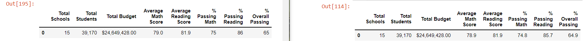

### School Summary
- There was about the same the percentage of students passing Math, passing reading, and overall passing at Thomas High School when comparing the original to updated summaries. Additionally, the averages also math and reading scores remained about the same. See tables below

Original School Data Summary
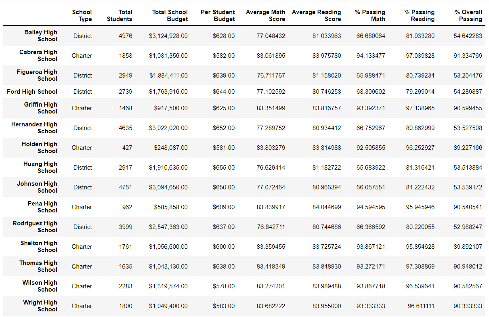
Updated School Data Summary
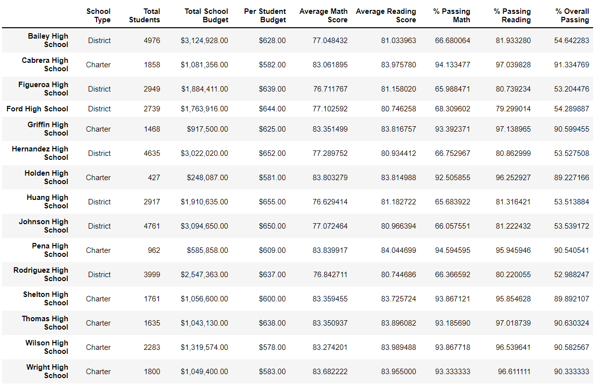
### Top and Bottom Performing Schools
- Thomas High School remains in the top 5 and 2nd highest place in performing schools.

Top 5 Performing Schools
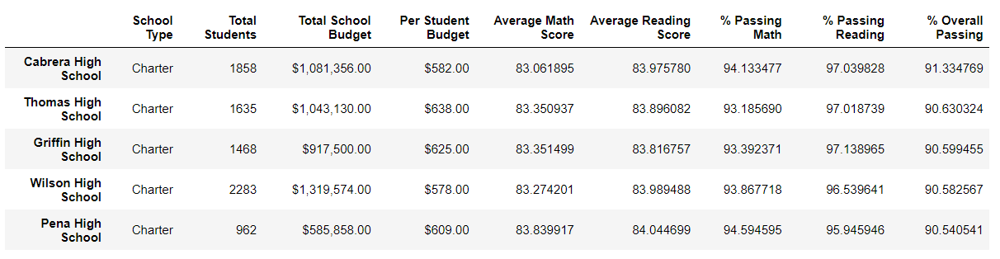

Bottom 5 Performing Schools
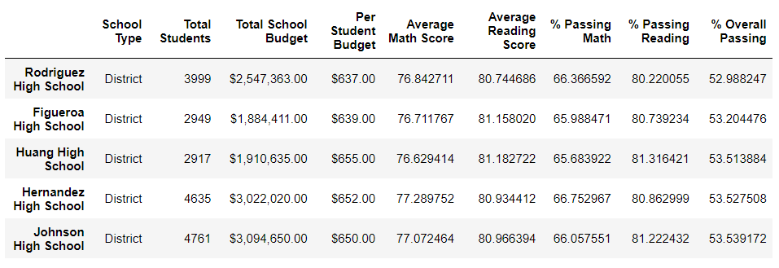

### Average Math and Reading Scores
- For Thomas High School "in" represents no score, seen in Math and reading scores.

#### Average Math Scores
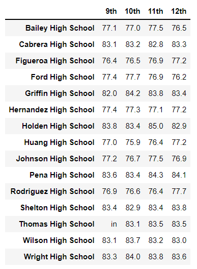

#### Average Reading Scores
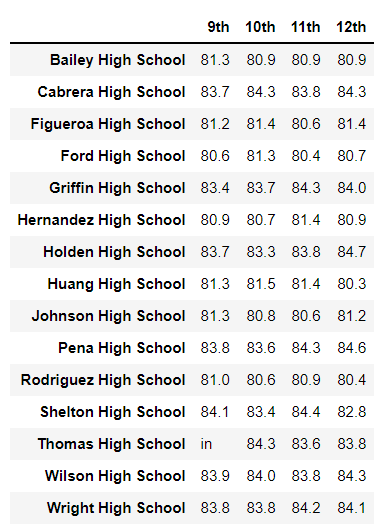

### Scores by School Spending
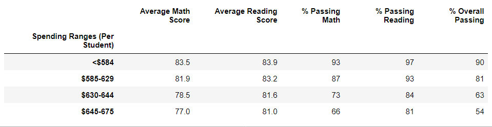

### Scores by School Size
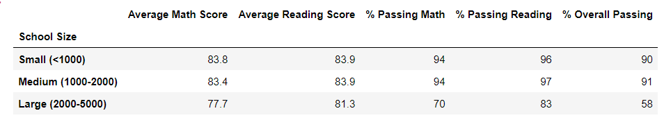

### Scores by School Type
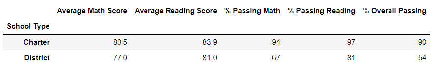

## Summary of Changes
  - There were minimal changes to the school district analysis with taking out 9th grade math and reading scores at Thomas High school. Changes that were noticed were slight decrease in Thomas High School students overall passing percentage in math and reading. No significant changes were seen. Having not included 9th grade scores, Thomas High School remains a top performing school. 
